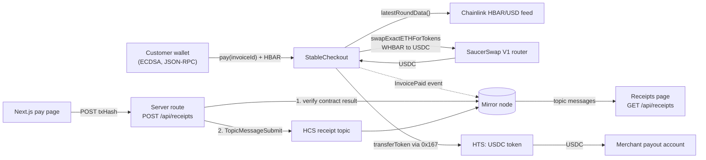

# HBAR Stable Checkout

```bash
npm create scaffold-hbar@latest -- --template piyushmali/hbar-stable-checkout
```

[](https://github.com/piyushmali/hbar-stable-checkout/actions/workflows/ci.yml)
[](LICENSE)

Accept HBAR, settle in USDC. A Scaffold-HBAR template for merchant checkout on Hedera: the merchant shares a link,
the customer pays in HBAR, and in the same transaction the `StableCheckout` contract swaps that HBAR to USDC (an HTS
token) on SaucerSwap and pays the merchant. A Chainlink HBAR/USD feed sets the minimum USDC the swap must return,
so a thin or manipulated pool reverts the payment instead of short-changing the merchant. Every settled payment
leaves a receipt on a Hedera Consensus Service (HCS) topic that anyone can audit through the mirror node.

**Contents:** [Architecture](#architecture) · [Prerequisites](#prerequisites) · [Quickstart](#quickstart) ·
[Environment variables](#environment-variables) · [How it works](#how-it-works) ·
[Integration notes](#integration-notes) · [Make it yours](#make-it-yours) · [Troubleshooting](#troubleshooting) ·
[Testnet evidence](#testnet-evidence) · [Security](#security)

## Architecture



| Integration | Role | Why it is load-bearing |
| --- | --- | --- |
| SaucerSwap V1 | Settlement path | The HBAR is converted to USDC inside `pay`. Without it there is nothing to settle in. |
| Chainlink HBAR/USD | Safety rail | Sets the minimum USDC output. Without it the merchant carries pool-price risk. |
| HTS | Settlement token | USDC is an HTS token: the contract and the payout account must be associated with it. |
| HCS + mirror node | Receipt ledger | One message per payment, readable by anyone; the merchant's history is the topic. |

Deeper dives: [docs/architecture.md](docs/architecture.md), [docs/oracle-floor.md](docs/oracle-floor.md),
[docs/hcs-receipts.md](docs/hcs-receipts.md).

## Prerequisites

- **Node.js 20.18.3 or later** (CI runs Node 22).
- **Yarn.** The repo pins Yarn 3.2.3 in `.yarn/releases`; any Yarn 1.22+ on your `PATH` hands off to it, or run
  `corepack enable` once.
- **An ECDSA account on Hedera testnet.** Create one at [portal.hedera.com](https://portal.hedera.com) and copy the
  account ID (`0.0.x`) and the HEX-encoded private key (`0x…`). ED25519 keys do not work: they have no EVM address,
  so the JSON-RPC relay cannot sign with them. An EVM address that receives HBAR also becomes an ECDSA account.
- **Testnet HBAR** from the [Hedera faucet](https://portal.hedera.com/faucet). About 10 HBAR covers a deploy, a
  topic and several payments.
- **Testnet USDC: none needed.** Customers pay in HBAR. Merchants only need their payout account associated with the
  USDC token `0.0.5449`, which the `/merchant` page does in one click (HIP-719 `associate()`). Accounts created from
  an EVM address have unlimited automatic associations, so they receive USDC without that step.

## Quickstart

```bash
# 1. Scaffold (pick any project name) and run the hermetic contract tests
npm create scaffold-hbar@latest -- --template piyushmali/hbar-stable-checkout
cd my-hedera-dapp
yarn hardhat:test

# 2. Deployer and HCS operator: an ECDSA testnet account (it can be the same one)
cp packages/hardhat/.env.example packages/hardhat/.env
#    set DEPLOYER_PRIVATE_KEY, HEDERA_OPERATOR_ID, HEDERA_OPERATOR_KEY

# 3. Deploy StableCheckout (writes packages/nextjs/contracts/deployedContracts.ts)
yarn hardhat:deploy --network hederaTestnet

# 4. Create the receipt topic, then give the web app the topic and the same operator
yarn hardhat:create-topic
cp packages/nextjs/.env.example packages/nextjs/.env.local
#    set HCS_TOPIC_ID (printed above), HEDERA_OPERATOR_ID, HEDERA_OPERATOR_KEY

# 5. Run the app on http://localhost:3000
yarn next:dev

# 6. Pay a real $0.10 invoice from the command line (or use the pages, below)
yarn hardhat:demo-pay
```

In the browser: open `/merchant`, connect an ECDSA wallet (MetaMask on Hedera testnet, or the scaffold's burner wallet
loaded with a funded key), register a payout account, check that it shows **Associated with USDC**, create an
invoice and open the checkout link it gives you. The `/pay/<invoiceId>` page quotes the invoice, pays it and writes
the HCS receipt; `/receipts` lists every receipt on the topic.

A fresh scaffold already points at the reference testnet deployment listed under [Testnet evidence](#testnet-evidence),
so you can skip step 3 and still use the pages (`yarn hardhat:demo-pay` needs your own deployment). Receipts need
your own topic (step 4), because only the topic's submit key can write to it.

| Command | What it does |
| --- | --- |
| `yarn hardhat:test` | Hermetic contract tests: HTS, SaucerSwap and Chainlink are mocks, no network access |
| `yarn fork:test` | Read-only checks against live Hedera mainnet state on a local fork (see [fallback](#testnet-unavailable-forked-mainnet-fallback)) |
| `yarn hardhat:deploy --network hederaTestnet` | Deploy and associate `StableCheckout`, regenerate the frontend ABI file |
| `yarn hardhat:create-topic` | Create the HCS receipt topic with the operator key as its submit key |
| `yarn hardhat:demo-pay` | Register the deployer as merchant, create a $0.10 invoice and pay it on testnet |
| `yarn next:dev` / `yarn next:build` | Run or build the Next.js app |
| `yarn lint` · `yarn format` · `yarn typecheck` · `yarn test` · `yarn build` | Repo-wide quality gates |

[`harness/`](harness/spec.yaml) holds a [hedera-harness](https://github.com/hedera-dev/hedera-harness) recipe for tiered
validation of the same gates plus a browser route check; [AGENTS.md](AGENTS.md#skills-and-validators) shows how to run it.

## Environment variables

Only the `.env.example` files are committed. `.env*` files are gitignored everywhere.

| Variable | File | Required | Example | Read by |
| --- | --- | --- | --- | --- |
| `DEPLOYER_PRIVATE_KEY` | `packages/hardhat/.env` | For deploy and demo | `0x4c0883a6…` (64 hex) | `hardhat:deploy`, `hardhat:demo-pay` |
| `DEPLOYER_PRIVATE_KEY_ENCRYPTED` | `packages/hardhat/.env` | Alternative to the above | written by `yarn hardhat:account:generate` | `hardhat:deploy` (asks for the password) |
| `HEDERA_RPC_URL` | `packages/hardhat/.env` | No | `https://testnet.hashio.io/api` | `hederaTestnet` network, testnet fork |
| `HEDERA_MAINNET_RPC_URL` | `packages/hardhat/.env` | No | `https://mainnet.hashio.io/api` | `hederaMainnet`, `fork:test` |
| `HEDERA_OPERATOR_ID` | `packages/hardhat/.env` and `packages/nextjs/.env.local` | For receipts | `0.0.1234567` | `hardhat:create-topic`, `POST /api/receipts` |
| `HEDERA_OPERATOR_KEY` | `packages/hardhat/.env` and `packages/nextjs/.env.local` | For receipts | `0x…` (ECDSA, same account) | Same; it becomes the topic's submit key |
| `HEDERA_NETWORK` | `packages/nextjs/.env.local` (and `packages/hardhat/.env` for create-topic) | No | `testnet` (default) or `mainnet` | API routes, `hardhat:create-topic` |
| `HCS_TOPIC_ID` | `packages/nextjs/.env.local` | For receipts | `0.0.7654321` | `/api/receipts`, `/api/health` |
| `NEXT_PUBLIC_WALLET_CONNECT_PROJECT_ID` | `packages/nextjs/.env.local` | No | your WalletConnect project ID | RainbowKit |
| `NEXT_PUBLIC_HEDERA_TESTNET_RPC_URL` | `packages/nextjs/.env.local` | No | `https://testnet.hashio.io/api` | wagmi transport |
| `NEXT_PUBLIC_HEDERA_MAINNET_RPC_URL` | `packages/nextjs/.env.local` | No | `https://mainnet.hashio.io/api` | wagmi transport |

The operator key is read only by the server route. Never give it a `NEXT_PUBLIC_` prefix: that would ship it in the
client bundle.

## How it works

### HBAR units: tinybars, weibars and USDC's 6 decimals

Inside the Hedera EVM, HBAR has 8 decimals: `msg.value`, balances and every HBAR amount in `StableCheckout` are
**tinybars** (1 HBAR = 10^8 tinybars). The JSON-RPC relay, for compatibility with EVM wallets, takes a
transaction's `value` in **weibars** (18 decimals, 1 tinybar = 10^10 weibars) and divides it by 10^10 before the
contract runs ([Hedera docs](https://docs.hedera.com/evm/differences/hbar-decimals)). USD amounts use 6 decimals,
the same as USDC, so an invoice amount is also its USDC amount. The Chainlink answer has 8 decimals.

```text
usd6     = tinybars * answer / 10^(8 + 8 - 6)        quoteUsdc, rounds down
tinybars = ceil(usd6 * 10^(8 + 8 - 6) / answer)      quoteTinybars, rounds up
```

**Worked example.** A $25.00 invoice with Chainlink at $0.10 (answer `10000000`):

| Step | Value |
| --- | --- |
| Invoice | `usdAmount6 = 25000000` |
| Oracle quote | `ceil(25000000 * 10^10 / 10000000) = 25000000000` tinybars = 250 HBAR |
| Pay page adds 1% | 25,250,000,000 tinybars = 252.5 HBAR |
| Wallet sends | `value = 252500000000000000000` weibars (252.5 × 10^18) |
| Contract sees | `msg.value = 25250000000` tinybars, oracle value `25250000` = $25.25 |
| Floor at 1% slippage | `25250000 * 9900 / 10000 = 24997500` = $24.9975 USDC |

The swap must return at least 24.9975 USDC or the whole transaction reverts. A real testnet run of the same math is in
[Testnet evidence](#testnet-evidence): $0.10 at $0.09962643 became 101,378,720 tinybars with a floor of $0.099989.

### Why the oracle floor exists

A DEX quote is the pool's opinion of the price, and a pool can be thin, stale or pushed by a sandwich in the same
block. `pay` therefore prices `msg.value` with Chainlink first:

1. Reject an incomplete round, a non-positive answer, or an answer older than `maxPriceAge` (25 hours by default:
   the Hedera HBAR/USD heartbeat is 24 hours with a 0.5% deviation trigger).
2. Require the oracle value of `msg.value` to cover the invoice (`Underpaid` otherwise).
3. Set `minUsdcOut` = oracle value × (1 − merchant slippage). Slippage is the merchant's choice, capped at 3%.
4. Check `getAmountsOut` against the floor (`PoolBelowFloor`), swap with `amountOutMin = minUsdcOut`, and measure the
   USDC actually received.

The floor is computed from the HBAR actually sent, not from the invoice amount. If it used the invoice, a customer's
overpayment buffer would sit unprotected and a sandwich could take it. Details: [docs/oracle-floor.md](docs/oracle-floor.md).

### HTS association

USDC is an HTS token, and HTS refuses to credit an account that is not associated with it. Two accounts receive USDC:

- **The contract.** The router sends the swap output to `StableCheckout`, so the constructor calls
  `associateToken(address(this), usdc)` on the HTS system contract at `0x167` and reverts with `AssociationFailed`
  unless the response code is `SUCCESS` (22) or `TOKEN_ALREADY_ASSOCIATED_TO_ACCOUNT` (194).
- **The merchant's payout account.** `pay` sends USDC with `transferToken`, which returns a response code instead of
  reverting. `TOKEN_NOT_ASSOCIATED_TO_ACCOUNT` (184) becomes the `PayoutNotAssociated` error, so nothing moves.
  The UI checks the payout account on the mirror node (`/api/v1/accounts/{id}/tokens`) before showing the pay
  button, and offers a HIP-719 `associate()` button when the payout account is the connected wallet. Accounts with
  free automatic association slots (−1 means unlimited) are associated by HTS on the first payout.

### Why receipts go through a server route

Solidity cannot write to HCS, and a client cannot be trusted to describe its own payment. After a payment, the pay
page POSTs only the transaction hash to `/api/receipts`. The server then:

1. Fetches `/api/v1/contracts/results/{txHash}` from the mirror node (8 s timeout) and requires `result` to be
   `SUCCESS` and `contract_id` to be this app's `StableCheckout`.
2. Decodes the `InvoicePaid` log emitted by that contract with viem. Every field of the receipt comes from that log
   and the consensus timestamp, never from the request body.
3. Scans the topic's messages from the payment's consensus time onwards; if a receipt for this hash exists, it
   returns it (`200 exists`).
4. Otherwise submits `{ v, invoiceId, merchant, payer, hbarIn, usdcOut, oraclePrice, txHash, consensusTs }` with
   `TopicMessageSubmitTransaction` (`201 recorded`).

`GET /api/receipts?merchant=0x…` reads the topic back through the mirror node, base64-decodes each message,
validates it with zod, drops duplicates and filters by merchant. Details: [docs/hcs-receipts.md](docs/hcs-receipts.md).

## Integration notes

| Component | Hedera testnet | Hedera mainnet | Source |
| --- | --- | --- | --- |
| SaucerSwapV1RouterV3 | `0.0.19264` (`0x…4b40`) | `0.0.3045981` (`0x…2e7a5d`) | [SaucerSwap deployments](https://docs.saucerswap.finance/developers/contracts) |
| WHBAR token (path[0]) | `0.0.15058` (`0x…3ad2`) | `0.0.1456986` (`0x…163b5a`) | same page; [swap quote](https://docs.saucerswap.finance/developers/v1/swap/swap-quote) |
| USDC | `0.0.5449` (SaucerSwap testnet USDC) | `0.0.456858` (Circle) | [SaucerSwap testnet API](https://test-api.saucerswap.finance/pools), [Circle](https://developers.circle.com/stablecoins/usdc-contract-addresses) |
| WHBAR/USDC V1 pool | `0.0.2661044` | `0.0.1462797` | `SaucerSwapV1Factory.getPair` (testnet `0.0.9959`, mainnet `0.0.1062784`) |
| Chainlink HBAR/USD | `0x59bC155EB6c6C415fE43255aF66EcF0523c92B4a` | `0xAF685FB45C12b92b5054ccb9313e135525F9b5d5` | [Chainlink Hedera feeds](https://docs.chain.link/data-feeds/price-feeds/addresses?network=hedera) |

Every address lives in [`packages/hardhat/config/hedera-testnet.ts`](packages/hardhat/config/hedera-testnet.ts) and
[`hedera-mainnet.ts`](packages/hardhat/config/hedera-mainnet.ts), each with its source.

- **Why SaucerSwap V1.** Its testnet WHBAR/USDC pool has real liquidity (about 305,000 USDC and 135,000 HBAR when this
  was written), and the V1 router takes HBAR directly (`swapExactETHForTokens`, wrapping to WHBAR itself) and quotes
  with `getAmountsOut`, which the contract uses for its pre-check. V2 has a testnet pool too but needs path-encoded
  fee tiers and a separate quoter.
- **Why not Circle's testnet USDC.** Circle's testnet token `0.0.429274` has no SaucerSwap pool (V1 or V2), so the
  template uses `0.0.5449`, the USDC that SaucerSwap's testnet pools trade. Mainnet uses Circle's `0.0.456858`.
- **The testnet pool is skewed.** It prices HBAR near $2.25 while Chainlink reports about $0.10, so a testnet merchant
  receives roughly 22 times the invoice in test USDC. The floor only rejects pools that pay *less* than the oracle,
  so payments succeed. On mainnet the pool sits within about 0.5% of Chainlink.
- **If the pool is thin or skewed the other way,** `pay` reverts with `PoolBelowFloor` and the pay page disables the
  button with the reason. Wait for liquidity, raise the merchant's slippage (at most 3%), or check the logic against
  mainnet state with the fork fallback below.

### Testnet unavailable: forked-mainnet fallback

```bash
yarn fork:test
```

This forks Hedera mainnet locally with `@hashgraph/system-contracts-forking` (HTS emulated at `0x167`), deploys
`StableCheckout` with the mainnet addresses, and checks it against live state: the Chainlink answer passes the
staleness and sign checks, the tinybar and USD quotes round-trip, and `previewPay` matches the real SaucerSwap
`getAmountsOut` and clears the floor. It is read-only: nothing is sent to Hedera, and no swap executes, because the
HTS emulator cannot mint WHBAR. `pay` itself is covered by the hermetic tests and by the real testnet payments below.
The test works around two emulator gaps (long-zero contracts load without code, and fork-local accounts must be
registered before association); the file header explains both.

## Make it yours

- **Switch the settlement token.** Change `usdcToken` and `usdcTokenId` in `packages/hardhat/config/hedera-*.ts` to
  another 6-decimal HTS stablecoin that has a WHBAR pool, then redeploy. The constructor rejects tokens without 6
  decimals; supporting other decimals means converting `usdAmount6` in `_quoteUsdc` and `quoteTinybars`.
- **Add a fee split.** In `StableCheckout._sendUsdc`, send `usdcOut * feeBps / 10_000` to a fee recipient and the
  rest to the payout account (two `transferToken` calls; the recipient must be associated too). Add the fee to
  `InvoicePaid`, bump the receipt to `v: 2` in `packages/nextjs/utils/checkout.ts`, and test it next to the happy path.
- **Single or multi-merchant.** Registration is open, so one deployment already serves many merchants and the
  receipts page filters by merchant. For a single-store deployment, make `registerMerchant` `onlyOwner`. For one topic
  per merchant, map merchants to topic IDs in `services/hedera/receipts.ts`.
- **Swap Chainlink for Pyth or Supra.** All price reads go through `latestPrice()`. Pyth is pull-based: the caller
  must post a Hermes update with `updatePriceFeeds` (and its fee) before `getPriceNoOlderThan`, and the price uses a
  signed exponent. Supra pushes `getSvalue` with millisecond timestamps. The `pyth-price-feeds` and
  `supra-push-oracle` skills in [hedera-skills](https://github.com/hedera-dev/hedera-skills) cover both. Keep the
  staleness and sign checks.

[AGENTS.md](AGENTS.md) lists the exact files to touch for each of these.

## Troubleshooting

| Symptom | Cause | Fix |
| --- | --- | --- |
| `INSUFFICIENT_PAYER_BALANCE` | The account cannot cover the HBAR sent plus gas. A payment uses about 225,000 gas (about 0.2 HBAR at testnet's 86 tinybars per gas), or about 930,000 when it also auto-associates USDC. | Fund the account from the [faucet](https://portal.hedera.com/faucet). |
| `TOKEN_NOT_ASSOCIATED_TO_ACCOUNT` or `PayoutNotAssociated` | The merchant's payout account is not associated with USDC and has no free automatic association slot. | `/merchant` → **Associate USDC** while connected as the payout account, or associate the token in HashPack. |
| `StalePrice` | The Chainlink answer is older than `maxPriceAge` (25 h). | Check the feed on [data.chain.link](https://data.chain.link/feeds/hedera/hedera/hbar-usd). The owner can change the limit with `setMaxPriceAge` (at most 2 days). |
| `PoolBelowFloor` (slippage) | SaucerSwap would return less USDC than the oracle floor. | Wait, add liquidity, or raise the merchant's slippage (at most 3%). |
| `Underpaid` | The oracle moved between quote and payment by more than the 1% buffer. | Reload the pay page for a fresh quote. |
| `INSUFFICIENT_GAS` | A hand-set gas limit below what HTS precompile calls need. | The app and scripts use the relay estimate plus 20%. Keep that pattern in your own scripts. |
| Receipt says `not_indexed` | The mirror node trails consensus by a few seconds. | The pay page retries with backoff (1 to 16 s). Otherwise POST the hash again later. |
| Deploy fails with "Sender account not found" | The deployer address has no Hedera account yet. | Send it testnet HBAR first; the first transaction completes the account. |

## Testnet evidence

Real transactions on Hedera testnet from this repo's scripts and pages:

| Item | Value | Links |
| --- | --- | --- |
| `StableCheckout` | `0x022c216E7532FC28382ECae7b8C077fc68d54da9` (`0.0.10831121`) | [HashScan](https://hashscan.io/testnet/contract/0.0.10831121) · [mirror node](https://testnet.mirrornode.hedera.com/api/v1/contracts/0.0.10831121) |
| Deploy, incl. USDC association | `0x07944c0f…0c50d51` | [HashScan](https://hashscan.io/testnet/transaction/0x07944c0fc587387ae97977b14283bae2bb7986bee607abee39d817dda0c50d51) · [mirror node](https://testnet.mirrornode.hedera.com/api/v1/contracts/results/0x07944c0fc587387ae97977b14283bae2bb7986bee607abee39d817dda0c50d51) |
| HCS receipt topic | `0.0.10831142` | [HashScan](https://hashscan.io/testnet/topic/0.0.10831142) · [mirror node](https://testnet.mirrornode.hedera.com/api/v1/topics/0.0.10831142/messages) |
| Paid invoice (`yarn hardhat:demo-pay`) | $0.10 invoice; 1.0137872 HBAR in at Chainlink $0.09962643; floor $0.099989; 2.280068 USDC to the merchant through SaucerSwap | [HashScan](https://hashscan.io/testnet/transaction/0xe7931756760ed9eff11e3987d735987f207a49a385b3ac7c0a0cb940d64e4e31) · [mirror node](https://testnet.mirrornode.hedera.com/api/v1/contracts/results/0xe7931756760ed9eff11e3987d735987f207a49a385b3ac7c0a0cb940d64e4e31) |
| HCS receipt for it | Topic message #1 | [HashScan](https://hashscan.io/testnet/transaction/1790972894.319064971) · [mirror node](https://testnet.mirrornode.hedera.com/api/v1/topics/0.0.10831142/messages/1) |
| Paid invoice (through `/merchant` and `/pay`) | Same amounts, 222,586 gas, receipt #2 written by the pay page | [HashScan](https://hashscan.io/testnet/transaction/0x173c6a97977d42d3cea18551097ec885e908a4ecf59be9c53e46a04fd646c25e) · [mirror node](https://testnet.mirrornode.hedera.com/api/v1/topics/0.0.10831142/messages/2) |

The merchant, payout and payer in these runs are the same test account, `0.0.10831099`.

## Security

**This is a testnet demo. It has not been audited.** Do not use it with real funds without a review.

- The router, feed and token addresses are immutable. The owner can only change `maxPriceAge` (bounded to 2 days);
  there is no withdrawal function, and the contract holds no funds between transactions.
- `pay` is `nonReentrant`, marks the invoice paid before any external call, and measures the USDC it receives instead
  of trusting the router's return value. Every state change emits an event and there are no unbounded loops.
- `POST /api/receipts` has no authentication. It only writes receipts for payments it has verified on the mirror
  node, once per transaction hash, so its cost is bounded by real payments. Add rate limiting in production.
- The receipt topic has a submit key and no admin key: only the operator can write, and nobody can delete it.
  Rotating the operator key means creating a new topic.
- Receipts are only as trustworthy as the mirror node that served them. Every receipt carries the transaction hash,
  so anyone can check it against a different mirror node.
- The scaffold's burner wallet is enabled for development. Turn off `enableBurnerWallet` in
  `packages/nextjs/scaffold.config.ts` before deploying the frontend anywhere public.

Built by [piyushmali](https://github.com/piyushmali) on Scaffold-HBAR. MIT licensed, see [LICENSE](LICENSE).
