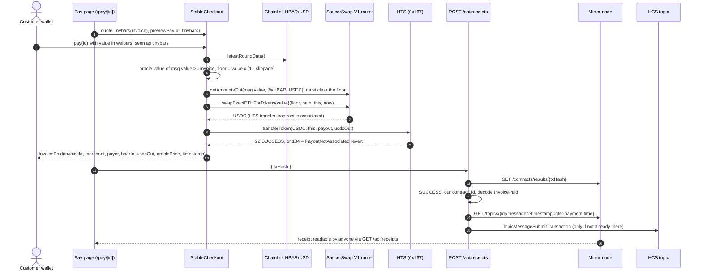

# Architecture

Two paths: the **payment** settles on-chain in one transaction, and the **receipt** is written afterwards by a server
route that trusts only the mirror node.

## Components

| Piece | File | Responsibility |
| --- | --- | --- |
| Contract | `packages/hardhat/contracts/StableCheckout.sol` | Merchant registry, invoices, oracle floor, swap, HTS payout |
| Interfaces | `packages/hardhat/contracts/interfaces/*.sol` | Minimal SaucerSwap V1 router, Chainlink aggregator, HTS |
| Addresses | `packages/hardhat/config/hedera-{testnet,mainnet}.ts` | Every external address with its source URL |
| Deploy | `packages/hardhat/deploy/00_deploy_stable_checkout.ts` | Deploys with the config, writes `deployedContracts.ts` |
| Scripts | `packages/hardhat/scripts/{demo-pay,create-topic}.ts` | Real testnet payment; one-time HCS topic creation |
| Receipt service | `packages/nextjs/services/hedera/receipts.ts` | Mirror node reads, verification, idempotency, HCS submit |
| API routes | `packages/nextjs/app/api/{receipts,health}/route.ts` | Thin HTTP layer with typed errors |
| Shared helpers | `packages/nextjs/utils/checkout.ts` | Units, receipt schema, links, error messages |
| Pages | `packages/nextjs/app/{merchant,pay/[invoiceId],receipts}/page.tsx` | Merchant setup, checkout, receipt feed |

## Trust boundaries

- **On-chain.** `StableCheckout` trusts only its immutable router, feed and token addresses. It never trusts the
  customer's amount (it prices `msg.value` itself) or the pool's price (the oracle floor), and it measures the USDC it
  receives instead of reading the router's return value.
- **Server.** The receipt route trusts the mirror node and nothing in the request except the transaction hash. It holds
  the only key that can write to the topic.
- **Client.** The pages hold no secrets. Quotes and previews are reads of the contract; the contract re-checks
  everything when the transaction executes.

## State model

An invoice is `None`, `Open` or `Paid` in storage. `Expired` is derived in `invoiceOf` from `expiry`, so expiring
an invoice costs nothing. A merchant record is `{ payout, maxSlippageBps, registered }`; merchants can change their
payout and slippage at any time, and `pay` uses the values current at payment time.

## Why not a local Hardhat node?

`yarn hardhat:chain` (a testnet fork with emulated HTS) cannot run this contract end to end with
`@hashgraph/system-contracts-forking` 0.1.2: SaucerSwap's long-zero contracts load without code, freshly deployed
contracts cannot be associated, and WHBAR cannot mint. Local development uses the hermetic tests
(`yarn hardhat:test`), the read-only mainnet fork (`yarn fork:test`) and Hedera testnet.
